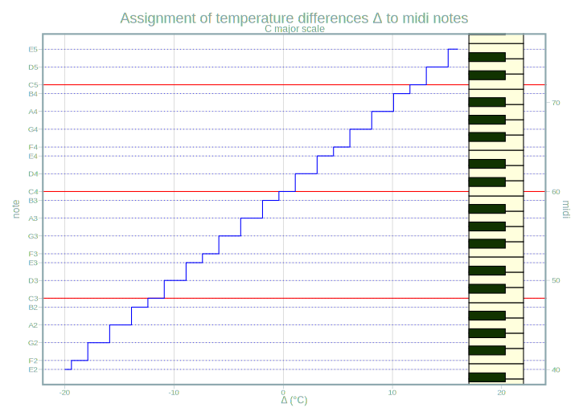
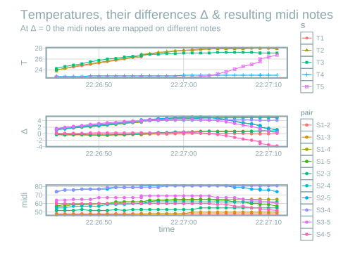
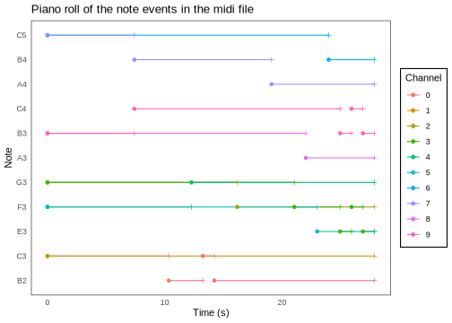

## Introduction 

Interested in arduino, midi audio or sound synthesis? This blog post
might interest you. Or you just have some spare minutes to watch and listen 
to and read about a project where live data is translated to sound. The cool thing is that
all the software used is completely free of charge. The only money spent was on 
the hardware (a microcontroller and some thermometers connected to the PC), which is not very expensive. All the software (microcontroller, programming, data management and audio-related) is completely free.


The article will give an overview over the [Chaos
Machine](https://gitlab.com/urswilke/chaos_machine_code) code repository. This
repository is the result of the artist and my friend Axel Crettenand having the
idea of his project called CHOEUR AQUATIQUE (the *Underwater Choir*) and hiring
me to develop the code.
  
As we live in different cities and traveling is difficult due to Covid-19 we decided it's best to make a public repository with the instructions for Axel to reconstruct the machine himself. 
And with the possibility that somebody else is interested I was more motivated to write a good documentation. :) This article is to briefly introduce you to the project.

To get an idea how the machine sounds so far please have a listen to the generated mp3 file in this [folder](https://gitlab.com/urswilke/chaos_machine_code/-/tree/master/python/recorded_data) (or scroll down to the audio player at the bottom of this article). This file is the synthesization of the midi file you can also find there.


## Technical description

Basically, the machine translates temperature measurements into sound in real time. The [arduino code sketch](https://gitlab.com/urswilke/chaos_machine_code/-/blob/master/arduino/send_temp/send_temp.ino) uploaded to the microcontroller reads the measured temperatures of multiple thermometers and then sends these to the computer. On the PC a python program (see [here](https://gitlab.com/urswilke/chaos_machine_code/-/blob/master/python/temperatures_to_midi.ipynb)) runs a main loop where the sent temperature data is again read in. Then the temperature differences are translated into midi notes of a chosen scale. The midi nodes are then sent to fluidsynth which finally synthesizes the midi notes to sound.  


### Main steps in the chaos machine

This is an interactive diagram.

* hover (mouse-over) to see description
* click on clickable nodes (not all) to view source code file

```{r, echo=FALSE}
# graphviz_code <- readr::read_file("https://gist.githubusercontent.com/urswilke/d49ccbf043bf2452f5bb9197e014d196/raw/6e60ffd6db1f755c990ce914a1afd8763988b644/graph_main.gv")
graphviz_code <- readr::read_file("graph_main.gv")

widgetframe::frameableWidget(DiagrammeR::grViz(graphviz_code))
```

The main interfaces are the serial connection between python and the arduino on the one hand. On the other hand, the midi format can either be synthesized directly with a midi port or by rendering the midi to audio files. This is done by fluidsynth using an sf2 soundfont that stores audio information for midi notes.

### Bigger picture

Watch here if you're interested in a deeper understanding of the available tools in the project and arduino / midi in general.

The execution of the code produces output files. These are then processed for visualization of the notes and audio file output. Furthermore, there are some auxiliary functions. The following diagram depicts how these programs can be used and how the terms roughly interact with each other.


```{r, echo=FALSE}
# graphviz_code <- readr::read_file("https://gist.githubusercontent.com/urswilke/9176fb739147c835f5d99aa01da7ee96/raw/f7fe3e9ba94dacdc74244f13dde61a8f96a8c90a/graph_complete.gv")
graphviz_code <- readr::read_file("graph_complete.gv")
graph_html <- DiagrammeR::grViz(graphviz_code)
graph_html$sizingPolicy$viewer$fill <- FALSE
# save svg:
# https://stackoverflow.com/questions/42737645/how-to-export-images-of-diagrammer-in-r


widgetframe::frameableWidget(graph_html)
```


#### Live plotter

Perhaps it's best to start with the data sent by the microcontroller. It's really easy to program a [live plotter in R](https://gitlab.com/urswilke/chaos_machine_code/-/blob/master/R/live_plotter/live_plotter.R) with the package [arduinor](https://github.com/r-arduino/arduinor). This yields an app shown here:


```{r, echo=FALSE}
vembedr::embed_url("https://youtu.be/BN-RWrFkblc")
```

showing how I touched 4 of the 5 thermometers briefly after starting the measurements.


#### Temperatures to midi 

Once the temperatures are measured and sent to rhe PC, python computes all the
pairwise differences and translates them to midi notes in a given scale. For the
C major scale this yields 

```{r, echo=FALSE}


```

where the function maps to the midi notes of the white piano keys. This is explained
in more detail [here](https://gitlab.com/urswilke/chaos_machine_code/-/blob/master/R/midi_intro/midi_intro.md).

#### Midi to audio 

With fluidsynth midi notes can be synthesized to audio with a soundfont file.
The soundfont specifies which sample is played for which midi note. A small
example how to do that via python can be seen
[here](https://gitlab.com/urswilke/chaos_machine_code/-/blob/master/python/play_soundfont/play_soundfont.ipynb). This yields in an increasing sequence of notes of the sound font. 
[This](https://musical-artifacts.com/artifacts/387) soundfont of choir voices was used.
You can
listen to the result in the following audio file:

```{r, echo=FALSE}
# from https://community.rstudio.com/t/audio-files-in-r-markdown/20874/3
html_tag_audio <- function(file, type = c("wav", "mp3")) {
  type <- match.arg(type)
  htmltools::tags$audio(
    controls = "",
    htmltools::tags$source(
      src = file,
      type = glue::glue("audio/{type}", type = type)
    )
  )
}


html_tag_audio("increasing_sequence.mp3", type = "mp3")

```


#### Output files

The main python programm produces 

* csv output files of 
  * the temperatures from the serial connection
  * the calculated temperature differences
  * the derived midi notes, as well as 
* a midi file
  * which is then transformed to audio files by fluidsynth using the specified sf2 soundfont
  * a musescore sheet music file

#### Python loop data


The data in the csv files is produced during the loop. Only look into that if you're interested in detail in the dictionary data structures that are used in the main loop. This data can be visualized as follows:

```{r echo=FALSE}

```


#### Midi files

Probably it's more interesting to look at the piano roll visualization of the 
midi file that's also generated. In the algorithm a new note is only started if it differs from the previous note, otherwise the previous is continued.


```{r echo=FALSE}

```


#### Audio files

The midi files can be rendered to audio files also using fluidsynth and a soundfont. 

You can listen to the result here:


#### Play mp3


```{r audio, echo=FALSE}
html_tag_audio("live_record.mp3", type = "mp3")
```

#### Musescore

[Musescore](https://musescore.org/) is a music notation software. The midi file
can be automatically translated to sheet music in the musescore mscz file format by
running 

```{bash, eval=FALSE}
mscore3 live_record.mid -o output_file.mscz
```

The mscz file can then be animated to this
[beauty](https://www.youtube.com/watch?v=XNDlgnyYGto)^[Also checkout the cool
animation of the midi data on the
[musescore](https://musescore.com/user/36624930/scores/6458979) webpage by
clicking play (make sure to choose the funky piano roll animation by clicking on
the piano key symbol!)]. The sound in this video was generated with their proper
soundfont. There is also one channel for percussion. :)

As can be seen in the video, it makes more sense to translate midi to sheet
music when the timing of the midi note events follows a stricter temporal
pattern (to make sure that the midi notes can be expressed by musical notes more
easily).

