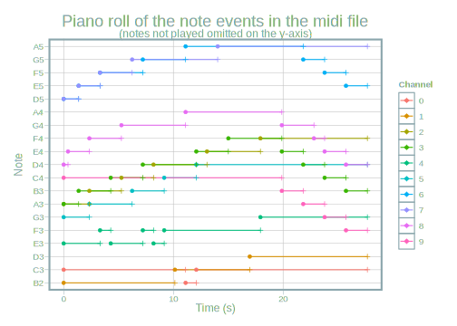

## tl;dr

Want to learn something about arduino, midi audio or sound synthesis? Using
python, R and many other tools. This blog post might interest you. Or you just
have some spare minutes to watch and listen to and read about a project where
live data is translated to sound. This article shows how the [Chaos
Machine](https://gitlab.com/urswilke/chaos_machine_code) produces sound like
this:


```{r, echo=FALSE}
# from https://community.rstudio.com/t/audio-files-in-r-markdown/20874/3
html_tag_audio <- function(file, type = c("wav", "mp3")) {
  type <- match.arg(type)
  htmltools::tags$audio(
    controls = "",
    htmltools::tags$source(
      src = file,
      type = glue::glue("audio/{type}", type = type)
    )
  )
}


html_tag_audio("live_record.mp3", type = "mp3")

```


## Introduction 

This is an introductory blog post with a strong focus on documentation and some
of the relevant topics if you want to construct such a machine. The cool thing
is that all the software used is free. The only money spent was on the hardware
(a circuit of a microcontroller and some thermometers), which is not very
expensive. All the software (microcontroller, programming, data management and
audio-related) is completely free.


I will give an overview over the [Chaos
Machine](https://gitlab.com/urswilke/chaos_machine_code) code repository. This
repository is the result of the artist and my friend Axel Crettenand having the
idea of his project called CHOEUR AQUATIQUE (the *Underwater Choir*) and hiring
me to develop the code.
  
As we live in different cities and traveling is difficult due to Covid-19 we
decided it's best to make a public repository with the instructions for Axel to
reconstruct the machine himself. And with the possibility that somebody else is
interested I was more motivated to write a good documentation. :) This article
is to briefly introduce you to the project.

To get an idea how the machine sounds so far you can have a listen to the
generated mp3 file in this
[folder](https://gitlab.com/urswilke/chaos_machine_code/-/tree/master/python/recorded_data)
(or scroll down to the audio player at the bottom of this article). This file is
the synthesization of the midi file you can also find there.


## Technical description

Basically, the machine translates temperature measurements into sound in real
time. The [arduino code
sketch](https://gitlab.com/urswilke/chaos_machine_code/-/blob/master/arduino/send_temp/send_temp.ino)
uploaded to the microcontroller reads the measured temperatures of multiple
thermometers and then sends them to the computer. On the PC a python program
(see
[here](https://gitlab.com/urswilke/chaos_machine_code/-/blob/master/python/temperatures_to_midi.ipynb))
runs a main loop where the sent temperature data is again read in. Then the
temperature differences are translated into midi notes of a chosen scale. The
midi nodes are then sent to fluidsynth which finally synthesizes the midi notes
to sound.


### Main steps in the chaos machine

This is an interactive diagram^[If you're interested how you can produce and
manipulate graphs like this with [graphviz](https://graphviz.org/) code try out
yourself with the interactive ObservableHQ notebook
[HERE](https://observablehq.com/@urswilke/workflow-of-the-chaos-machine-project).]


* hover (mouse-over) to see description
* click on clickable nodes (not all) to view source code file

```{r, echo=FALSE}
# graphviz_code <- readr::read_file("https://gist.githubusercontent.com/urswilke/d49ccbf043bf2452f5bb9197e014d196/raw/6e60ffd6db1f755c990ce914a1afd8763988b644/graph_main.gv")
graphviz_code <- readr::read_file("graph_main.gv")

widgetframe::frameableWidget(DiagrammeR::grViz(graphviz_code))
```

The main interfaces are the serial connection between python and the arduino on the one hand. On the other hand, the midi format can either be synthesized directly with a midi port or by rendering the midi to audio files. This is done by fluidsynth using an sf2 soundfont that stores audio information for midi notes.

### Bigger picture

Watch here if you're interested in a deeper understanding of the available tools
in the project and arduino / midi in general.

The execution of the code produces output files. These are then processed for
visualization of the notes and audio file output. Furthermore, there are some
auxiliary functions. The following diagram depicts how these programs can be
used and how the elements roughly interact with each other.


```{r, echo=FALSE}
# graphviz_code <- readr::read_file("https://gist.githubusercontent.com/urswilke/9176fb739147c835f5d99aa01da7ee96/raw/f7fe3e9ba94dacdc74244f13dde61a8f96a8c90a/graph_complete.gv")
graphviz_code <- readr::read_file("graph_complete.gv")
graph_html <- DiagrammeR::grViz(graphviz_code)
graph_html$sizingPolicy$viewer$fill <- FALSE
# save svg:
# https://stackoverflow.com/questions/42737645/how-to-export-images-of-diagrammer-in-r


widgetframe::frameableWidget(graph_html)
```

## Further short descriptions 

### Live plotter

Perhaps it's best to start with the data sent by the microcontroller. It's
really easy to program a [live plotter in
R](https://gitlab.com/urswilke/chaos_machine_code/-/blob/master/R/live_plotter/live_plotter.R)
with the package [arduinor](https://github.com/r-arduino/arduinor). This yields
an app shown here:


```{r, echo=FALSE}
vembedr::embed_url("https://youtu.be/BN-RWrFkblc")
```

showing how I touched 4 of the 5 thermometers briefly after starting the measurements.


### Temperatures to midi 

#### Translation scheme

Once the temperatures are measured and sent to the PC, python computes all the
pairwise differences and translates them to midi notes in a given scale. For the
C major scale this yields 

```{r, echo=FALSE}
knitr::include_graphics("T_to_midi_Cmaj.svg")

```

where the function maps to the midi notes of the white piano keys. This is
explained in more detail
[here](https://gitlab.com/urswilke/chaos_machine_code/-/blob/master/R/midi_intro/midi_intro.md).

#### Python loop data


To get an idea how the translation scheme works, have a look at this plot:

```{r echo=FALSE}
knitr::include_graphics("csv_vis.svg")
```

It shows the live data that is generated during the main loop. The differences
``r "\u0394"`` of the temperatures `T` received from the microcontroller are 
transformed to `midi` notes according to the scheme. 
The data for the plot is produced during the loop and saved to csv files after
the loop has finished. Only look into these csv files if you're interested in
more detail what kind of data structures are used to control the main
loop.


### Midi to audio (live)

Once the midi notes are sent, they can be synthesized to audio with fluidsynth
and a soundfont file. The soundfont specifies which sample is played for which
midi note. An example how to do that with python can be seen
[here](https://gitlab.com/urswilke/chaos_machine_code/-/blob/master/python/play_soundfont/play_soundfont.ipynb).
This yields in an increasing sequence of notes of the sound font.
[This](https://musical-artifacts.com/artifacts/387) soundfont of choir voices
was used. You can enjoy the result in the following audio file:

```{r, echo=FALSE}
html_tag_audio("increasing_sequence.mp3", type = "mp3")
```

Consider this as a minimal example how to send live midi data with python to
fluidsynth and after the session translate the recorded live data to a midi file
and render it to the audio file that you were about to listen. 

### Output files

The main python programm produces 

* csv output files (as already mentioned) of 
  * the temperatures from the serial connection
  * the calculated temperature differences
  * the derived midi notes, as well as 
* a midi file
  * which is then transformed to audio files by fluidsynth using the specified sf2 soundfont
  * a musescore sheet music file


### Midi files

The piano roll visualizations of the midi notes can also be derived from the
midi file that's  generated after the loop has finished. In the algorithm a new
note is only started (o) if it differs from the previous note, otherwise the
previous is not stopped (+).


```{r echo=FALSE}

```


#### Audio files

The midi files can be rendered to audio files also using fluidsynth and a soundfont. 

You can listen to the result here:


```{r audio, echo=FALSE}
html_tag_audio("live_record.mp3", type = "mp3")
```

#### Musescore

[Musescore](https://musescore.org/) is a music notation software. The midi file
can be automatically translated to sheet music in the musescore mscz file format by
running 

```{bash, eval=FALSE}
mscore3 live_record.mid -o output_file.mscz
```

The mscz file can then be animated to this
[beauty](https://www.youtube.com/watch?v=XNDlgnyYGto)^[Also checkout the 
animation of the midi data on the
[musescore](https://musescore.com/user/36624930/scores/6458979) webpage by
clicking play (make sure to also choose the funky piano roll animation by clicking on
the piano key symbol!)]. The sound in this video was generated with their proper
soundfont. There is also one channel for percussion. :)


As can be seen in the video, it makes more sense to translate midi to sheet
music when the timing of the midi note events follows a stricter temporal
pattern (to make sure that the midi notes can be expressed by musical notes more
easily).

